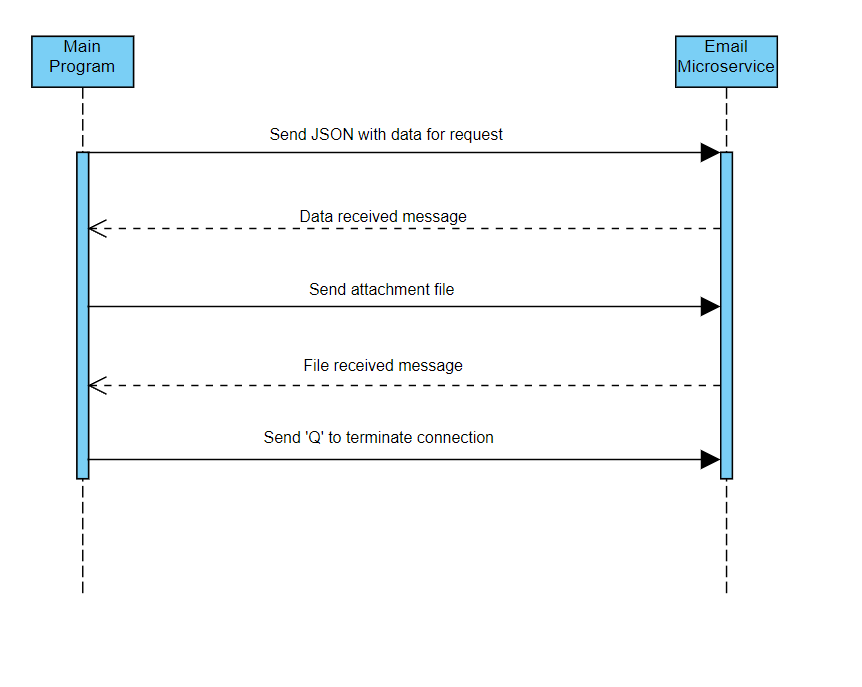

# Employee Email Notification System

## Overview

This microservice sends an email to an employee with a paystub, work schedule or an update. The microservice receives the information about the request from the client followed by a file to send as an attachment. The microservice then composes the email and sends it to the employee.

## How to Request and Receive Data from Microservice

The client must create and connect to a ZeroMQ REQUEST socket corresponding to the microservice REPLY socket via TCP to port 5555 on localhost. The client will then send a JSON object with the request data to the microservice. JSON object must have the keys as set up in example below.

Example:
```python
    email_data = {"name": "Mike Fisher",
                  "email": "fishemic@oregonstate.edu",
                  "type": "paystub"}
    socket.send_json(email_)data
```

The client will receive a reply acknowledging the data was received by the microservice. The client then sends opens the file for the email attachment and sends to the microservice. The microservice will receive the file and save it with a new file name. The microservice will send a response back to the client confirming receipt of the file.

Example of receiving data:
```python
    message = socket.recv()
```
Sending file:
```python
    with open("paystub.pdf", "rb") as f:
        data = f.read()
        socket.send(data)
```
The client then sends 'Q' to terminate the connection.

The service will then compose and send the email to the employee information provided in the request with the attached file. The microservice is set up to send emails from a Gmail account. The user will have to set up their credentials(create an app password for the gmail account to use for this service) in a .env file in the same directory as the microservice file. The microservice will use these environment variables to connect and send the email.

## Sequence Diagram

